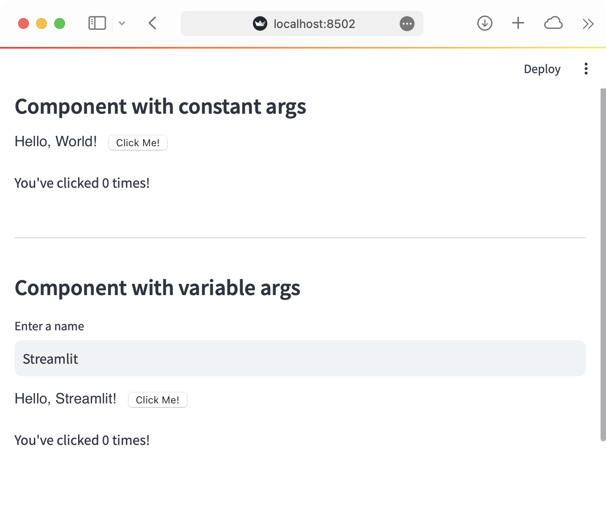

# Streamlit Component Vue Vite Template

A template for creating Streamlit Components. It uses Vue 3 to code the frontend and Vite to serve the files locally during development, as well as bundle and compile them for production.

This repo contains templates and example code for creating [Streamlit](https://streamlit.io) Components. For complete information, please see the [Streamlit Components documentation](https://docs.streamlit.io/en/latest/streamlit_components.html)!

## Quickstart

Ensure you have [Python 3.6+](https://www.python.org/downloads/), [Node.js](https://nodejs.org) and [npm](https://docs.npmjs.com/downloading-and-installing-node-js-and-npm) installed.

1. Clone this repository:
``` bash
git clone git@github.com:gabrieltempass/streamlit-component-vue-vite-template.git
```

2. Go to the `frontend` directory and initialize and run the component template frontend:
``` bash
cd streamlit-component-vue-vite-template/my_component/frontend
```
``` bash
npm install
npm run dev
```

3. From a separate terminal, go to the repository root directory, create a new Python virtual environment, activate it and install Streamlit and the template as an editable package:
``` bash
cd streamlit-component-vue-vite-template
```
``` bash
python3 -m venv venv
. venv/bin/activate
pip install streamlit
pip install -e .
```

Still from the same separate terminal, run the example Streamlit app:
``` bash
streamlit run my_component/example.py
```

If all goes well, you should see something like this:



Modify the frontend code at `my_component/frontend/src/MyComponent.vue`.
Modify the Python code at `my_component/__init__.py`.

## References

This template is based on:
* [the original template made by the Streamlit team](https://github.com/streamlit/component-template/tree/master/template), that uses React (instead of Vue 3) and Webpack (instead of Vite).
* [streamlit-component-template-vue](https://github.com/andfanilo/streamlit-component-template-vue/tree/vue3), by [@andfanilo](https://github.com/andfanilo), that uses Vue 2 or 3 and Webpack (instead of Vite). 
